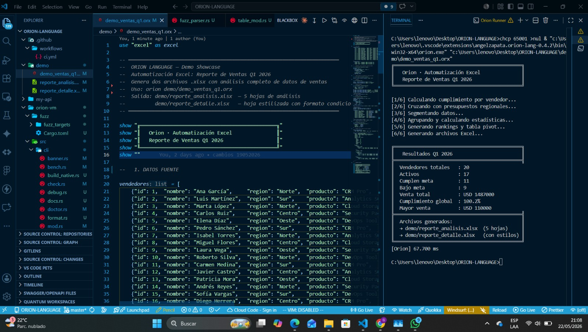
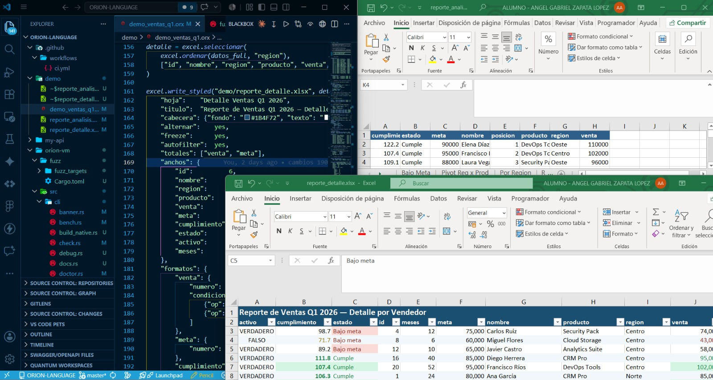
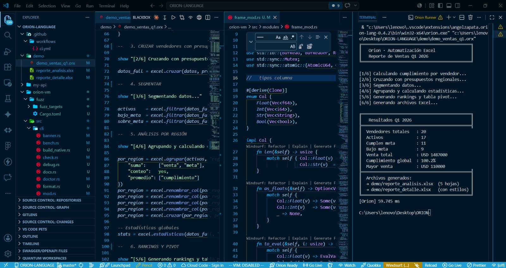

<div align="center">

# Orion

**A programming language for backend, automation and data work.**
Clean syntax, 61 built-in modules, and three ways to run the same code:
interpreted, JIT-compiled, or compiled to a native executable.

[](https://github.com/angeldevmobile/Orion/releases/latest)
[](https://marketplace.visualstudio.com/items?itemName=AngelZapata.oriondev)
[](LICENSE)


[Install](#installation) · [Examples](#a-taste-of-orion) · [Performance](#performance) · [CLI](#the-cli) · [Docs](#documentation) · [Roadmap](#where-it-is-going)

</div>

```orion
use "db"

db.exec("app.db", "CREATE TABLE IF NOT EXISTS users (id INTEGER PRIMARY KEY, name TEXT)")

fn router(req) {
    if req["path"] == "/users" and req["method"] == "GET" {
        return { "status": 200, "body": db.query("app.db", "SELECT * FROM users") }
    }
    if req["path"] == "/users" and req["method"] == "POST" {
        db.insert("app.db", "INSERT INTO users (name) VALUES (?)", [req["body"]])
        return { "status": 201, "body": { "ok": yes } }
    }
    return { "status": 404, "body": "not found" }
}

serve 8080 router
```

A JSON API with a database, no framework and no dependencies: `orion api.orx`.

---

## What is Orion?

Orion is a general-purpose language built for the work most scripts and
services actually do: serve an API, move files, read a spreadsheet, drive a
browser, call a model, ship a report. The tools for that are part of the
language and its standard library, not packages to install and keep in sync.

- **Backend** - `serve` is a statement; routing, middleware, auth, a database,
  cache, mail and validation are built-in modules.
- **Automation** - files and processes, a browser driven over CDP with no
  driver, SSH, Docker, S3, Excel and PDF.
- **Data** - columnar dataframes, statistics, time series, linear algebra.
- **AI** - `think` is a keyword; `llm`, `embed` and `vector` cover models,
  embeddings and semantic search.

It is a single executable written in Rust: no runtime, no virtual environment,
no `node_modules`. The compiler front end is shared by three engines - a
bytecode interpreter, a Cranelift JIT and an ahead-of-time compiler - and
differential tests check that they print the same result.

### Where it differs from Python

| | Python | Orion |
|---|---|---|
| Speed | interpreted, GIL | Rust VM + Cranelift JIT |
| Start-up | 150-400 ms | < 1 ms |
| AI, HTTP server, database | `pip install` | standard library |
| Native executable | third-party tools | `orion --build` |
| Package manager | pip | `orion --add` |

---

## A taste of Orion

### Data, without pandas

```orion
use "frame"

f = frame.open("sales.csv")              -- columnar load, types inferred
frame.peek(f, 5)
show frame.stats(f, "sale")              -- {count, mean, std, min, p25, median, p75, max}

by_region = frame.group(f, "region", "sale", "sum")
top       = frame.sort(f, "sale", "desc")
```

### A browser, without Selenium

```orion
use "browser" as web

with b = web.open() {                    -- uses the Chrome or Edge you already have
    p = web.page(b)
    web.goto(p, "https://example.com/catalog")
    items = web.extract(p, ".card", {
        name:  ".title",
        price: ".price|num",
        url:   "a@href"
    })
    show items
}
```

No `chromedriver` and no browser download. `with` closes the browser even if
the body fails. Full reference: [BROWSER.md](BROWSER.md).

### Objects, errors and concurrency

```orion
shape Account {
    owner:   string = ""
    balance: int    = 0

    on_create(o: string, b: int) {
        owner   = o
        balance = b
    }

    act withdraw(n) {
        if n > balance { error "insufficient funds" }
        balance = balance - n
    }
}

acc = Account("Ana", 100)
attempt {
    acc.withdraw(500)
} handle err {
    show "Error: " + err
}

async fn square(n) { return n * n }
show await square(9)                     -- 81
```

### A report, end to end



```orion
use "excel" as excel

full_data = excel.join(sellers, budgets, "region", "left")
pivot     = excel.pivot(full_data, "region", "producto", "venta")

excel.write_multi("sales_report.xlsx", {
    "Summary":   summary,
    "By Region": by_region,
    "Pivot":     pivot
})
```



The full script is [`demo/demo_ventas_q1.orx`](demo/demo_ventas_q1.orx): 70 lines,
16 ms. More in [`demo/`](demo/) and [`examples/`](examples/).

---

## Performance

Measured, not promised: every number below comes from a script in
[`bench/`](bench/) that you can run yourself.

**Interpreter vs JIT.** `orion file.orx` runs the interpreter; `orion --jit
file.orx` compiles to machine code. In the JIT, numbers live inside the value
(no allocation) and arithmetic compiles to plain CPU instructions.
`bench\jit\run_jit.ps1`, best of 3, wall time including start-up:

| Program | Interpreter | JIT | Peak RAM (JIT) |
|---|---:|---:|---:|
| 10M integer additions | 3.87 s | **0.10 s** | 12 MB |
| 5M float operations | 3.55 s | **0.13 s** | 12 MB |
| `fib(30)`, recursive | 2.20 s | **0.07 s** | 12 MB |
| Fill and sum a 1M-element list | 1.27 s | **0.16 s** | 20 MB |

**Data loading vs Python.** 500k CSV rows into typed columns, then `sum` and
`mean`; both languages print the same digits. `bench\run_all.ps1`:

| Pipeline | Time | Peak RAM |
|---|---:|---:|
| Python 3.13, `csv` stdlib | 516 ms | 105 MB |
| **Orion `frame.open`, CSV** | **264 ms** | **104 MB** |
| **Orion `frame.open`, .odf** | **88 ms** | **73 MB** |

**Web scraping vs Selenium and Playwright.** 500 product cards × 4 fields from
a local page. [`bench/web/`](bench/web/README.md):

| Tool | Extraction | Whole process | RAM (all processes) |
|---|---:|---:|---:|
| Selenium, idiomatic | 14,132 ms | 24,953 ms | 62 MB |
| Playwright, idiomatic | 9,234 ms | 12,175 ms | 317 MB |
| **Orion `extract`** | **8 ms** | **745 ms** | **16 MB** |

---

## Installation

### Prebuilt binary (recommended)

Download the executable for your platform from
[the latest release](https://github.com/angeldevmobile/Orion/releases/latest).
It is a single file, with no runtime and no dependencies.

| Platform | File |
|---|---|
| Windows x64 | `orion-win32-x64.exe` |
| Linux x64 | `orion-linux-x64` |
| macOS Apple Silicon | `orion-darwin-arm64` |

```bash
# Linux / macOS - rename, make executable, put it on the PATH
chmod +x orion-linux-x64
sudo mv orion-linux-x64 /usr/local/bin/orion
```

On Windows, rename the `.exe` to `orion.exe` and add its folder to your `PATH`.

### Build from source

```bash
cargo build --release --manifest-path orion-vm/Cargo.toml
./orion-vm/target/release/orion file.orx
```

### Your first program

Create `hello.orx`:

```orion run
name    = "Orion"
version = 1

show "Hello from ${name} v${version}"

-- Ranges are half-open: 1..5 covers 1, 2, 3 and 4.
for i in 1..5 {
    show "  line ${i}"
}
```

```bash
orion hello.orx
```

```
Hello from Orion v1
  line 1
  line 2
  line 3
  line 4
```

---

## VS Code extension

Install [**Orion Language**](https://marketplace.visualstudio.com/items?itemName=AngelZapata.oriondev)
from the Marketplace. It downloads the compiler the first time you open a
`.orx` file, so there is nothing else to set up; if `orion` is already on your
`PATH`, it uses that one.



- Syntax highlighting, IntelliSense and real compiler diagnostics as you type (LSP)
- `▶ Run` code lens, watch mode, and an integrated REPL
- Debugger with breakpoints, stepping and watches (DAP)
- Test explorer for `test_*.orx`, route explorer with a REST client
- Shape diagram and import graph

---

## The CLI

```bash
orion file.orx                # run (interpreter)
orion --jit file.orx          # run with the JIT
orion --build file.orx        # compile to a standalone native executable
orion                         # interactive REPL

orion new my-api              # new project: server, manifest, tests
orion check main.orx          # check syntax
orion check main.orx --types  # check static types
orion test                    # run every test_*.orx
orion watch main.orx          # re-run on save
orion bench main.orx --runs=20
orion doctor                  # diagnose the environment

orion --add <package>         # package manager: --add, --remove, --list,
orion --publish               # --search, --update, --publish
```

The REPL keeps state between lines: `:vars` and `:fns` list what is defined,
`:clear` resets it, `:exit` quits.

---

## Standard library

61 modules ship inside the executable. Import one with `use "name"`.

| Area | Modules |
|---|---|
| Core | `fs` `json` `strings` `datetime` `random` `regex` `env` `process` `crypto` `term` |
| System | `log` `config` `secret` `zip` `stream` `crypto2` `state` |
| Web | `net` `ws` `serve` `router` `middleware` `sse` `proto` `browser` |
| Backend | `db` `auth` `cache` `session` `mail` `validate` |
| Automation | `tarea` `cola` `chan` `watch` |
| Data and science | `csv` `excel` `excel_f` `table` `frame` `serie` `stat` `matrix` `search` |
| AI | `llm` `embed` `vector` `ai` `vision` `insight` |
| Interfaces | `gui` `tui` |
| Cloud | `s3` `ssh` `docker` |
| Other | `template` `formato` `grafo` `pdf` `quantum` `cosmos` `timewarp` |

Every module with examples: [docs/stdlib.md](docs/stdlib.md).

---

## Documentation

| Page | What it covers |
|---|---|
| [docs/language.md](docs/language.md) | Syntax: types, control flow, functions, shapes, errors, `serve`, pipes, concurrency |
| [docs/stdlib.md](docs/stdlib.md) | The 61 modules, with examples |
| [BROWSER.md](BROWSER.md) | Web automation with the `browser` module |
| [docs/architecture.md](docs/architecture.md) | Compiler pipeline, the three engines, component status |
| [docs/roadmap.md](docs/roadmap.md) | Designed and planned work |
| [SPEC.md](SPEC.md) | The language specification |
| [CHANGELOG.md](CHANGELOG.md) | What changed in each release |
| [BACKLOG.md](BACKLOG.md) | What is known to be missing or broken |

---

## Project status

Orion is young: version 0.1.x, built and maintained by one developer, with a
small package ecosystem. Everything listed above works and is covered by
tests, and the known gaps are written down in [BACKLOG.md](BACKLOG.md) rather
than left for you to find - for example, the JIT does not yet free strings and
lists that are no longer used, which matters for long-running processes.

### Where it is going

Orion is not a finished experiment; it is under active development, and the
goal is for people to use it for real work. Releases come often (see
[CHANGELOG.md](CHANGELOG.md)), and what gets built next is decided by what
gets in the way of using it: the interpreter getting closer to the JIT,
memory management in the JIT, more packages, and whatever users run into.

If you try it, that is the most useful contribution there is. Use it for a
script, a small service or a report, and
[open an issue](https://github.com/angeldevmobile/Orion/issues) with what
broke, what was missing or what felt wrong. Reports from real use shape the
roadmap more than anything else.

Orion is written in English. The Spanish names that came first still work as
deprecated aliases for the rest of 0.1.x (`db.insertar` runs, `db.insert` is
the name to use). See [SPEC.md](SPEC.md) section 11.

## Contributing

Bug reports and patches are welcome; [CONTRIBUTING.md](CONTRIBUTING.md)
explains how the project is laid out and how to run the tests. To add a module
to the standard library, create `orion-vm/src/modules/my_module.rs` and
register it in `orion-vm/src/modules/mod.rs`; the builtins registry that feeds
autocompletion and the type checker is regenerated from it on every build.

## License

[MIT](LICENSE) - built by Angel Zapata, 2025-2026.
