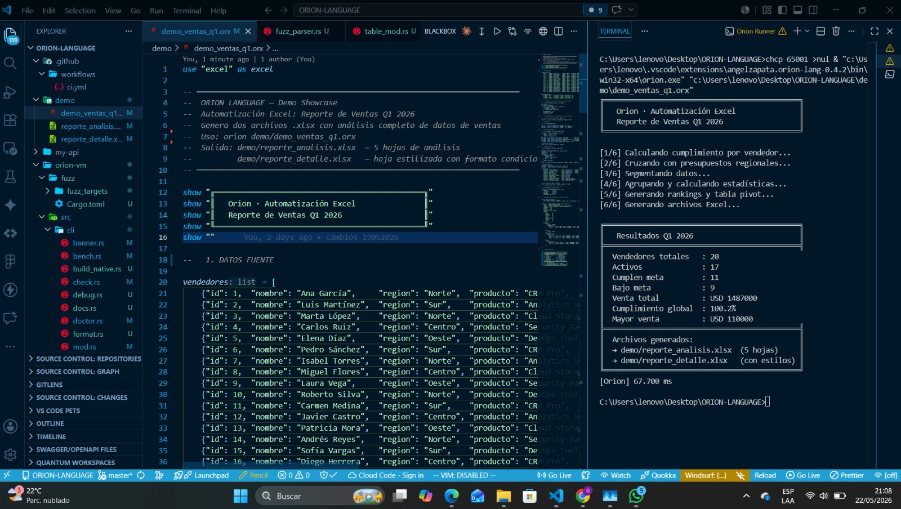
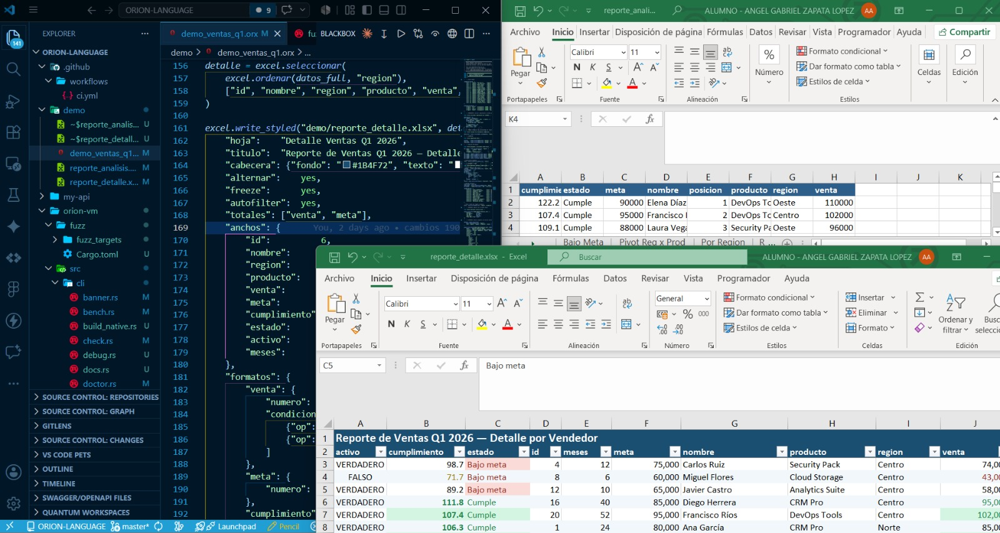
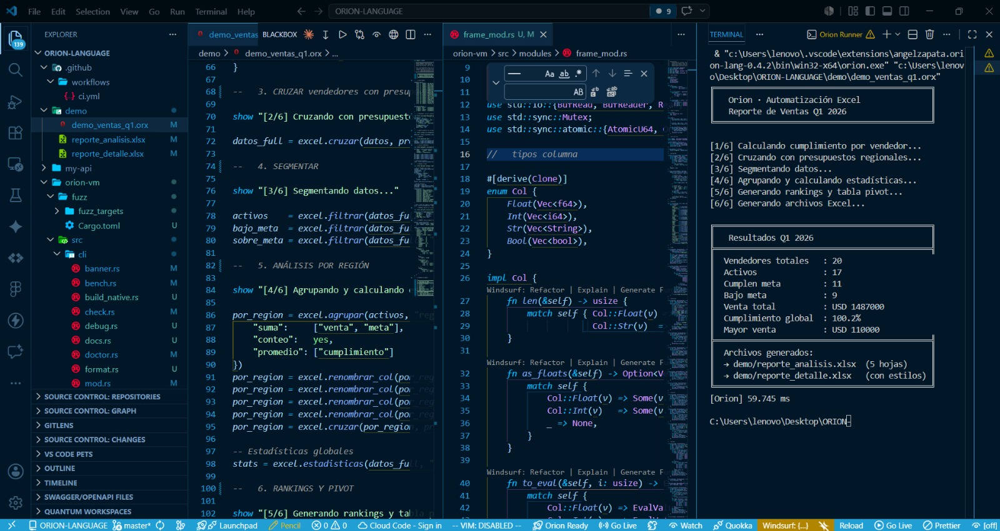

# Orion Language

Orion es un lenguaje de programación moderno orientado a backend y automatización.
Sintaxis limpia, tipado opcional, OOP nativa, 58 módulos integrados y pipeline completo en Rust.

> Construido por **Angel Zapata** · 2025-2026

---

## Demo



```orion
-- demo/demo_ventas_q1.orx  -  70 líneas · 16 ms
use "excel" as excel

datos_full = excel.cruzar(vendedores, presupuestos, "region", "left")
pivot      = excel.pivot(datos_full, "region", "producto", "venta")

excel.write_multi("reporte_analisis.xlsx", {
    "Resumen":    resumen,
    "Por Region": por_region,
    "Top 10":     top_10,
    "Pivot":      pivot
})
```

```
╔══════════════════════════════════════════════╗
║   Resultados Q1 2026                         ║
╠══════════════════════════════════════════════╣
║  Vendedores totales   : 20                   ║
║  Venta total          : USD 1487000          ║
║  Cumplimiento global  : 100.2%               ║
║  Mayor venta          : USD 110000           ║
╠══════════════════════════════════════════════╣
║  → demo/reporte_analisis.xlsx  (5 hojas)     ║
║  → demo/reporte_detalle.xlsx   (con estilos) ║
╚══════════════════════════════════════════════╝
[Orion] 15.978 ms
```



---

## Filosofía

- **Sin boilerplate** - el código se lee como pseudocódigo. Una tarea = máximo 5 líneas.
- **Real** - pensado para construir cosas reales: APIs, automatizaciones, pipelines de datos.
- **Moderno** - OOP, type hints, interpolación, async/await, IA nativa, regex, AI como keyword.
- **Rápido** - pipeline completo en Rust: lexer → parser → type checker → codegen → VM. Cargar y agregar 500k filas de CSV: **2× más rápido que Python con la misma RAM** ([benchmark reproducible](bench/)).
- **Seguro** - queries parametrizadas, validación en frontera, crypto nativo.

---

## Instalación

### Binario precompilado (recomendado)

Descarga el ejecutable de tu plataforma desde
[la última release](https://github.com/angeldevmobile/Orion/releases/latest).
Es un solo archivo, sin runtime ni dependencias.

| Plataforma | Archivo |
|---|---|
| Windows x64 | `orion-win32-x64.exe` |
| Linux x64 | `orion-linux-x64` |
| macOS Apple Silicon | `orion-darwin-arm64` |

```bash
# Linux / macOS - renombrar, dar permisos y poner en el PATH
chmod +x orion-linux-x64
sudo mv orion-linux-x64 /usr/local/bin/orion

orion archivo.orx
```

En Windows, renombra el `.exe` a `orion.exe` y agrégalo al `PATH`.

### Extensión VSCode

Instálala desde el Marketplace:
[**Orion Language**](https://marketplace.visualstudio.com/items?itemName=AngelZapata.oriondev).

La extensión descarga el compilador automáticamente la primera vez que abres un
`.orx` (lo toma de la última release y lo guarda en el almacenamiento global de
VSCode). Si ya tienes `orion` en el `PATH`, usa ese.

### Compilar desde fuente

```bash
cargo build --release --manifest-path orion-vm/Cargo.toml
./orion-vm/target/release/orion archivo.orx
```

---

## Quick Start

Crea un archivo `hola.orx` y ejecútalo:

```orion
nombre  = "Orion"
version = 1

show "Hola desde ${nombre} v${version}"

-- Los rangos son semiabiertos: 1..5 recorre 1, 2, 3 y 4.
for i in 1..5 {
    show "  línea ${i}"
}
```

```bash
orion hola.orx
```

```
Hola desde Orion v1
  línea 1
  línea 2
  línea 3
  línea 4
[Orion] 1.346 ms
```

O corre el demo completo:

```bash
orion demo/demo_ventas_q1.orx
```

---

## Sintaxis

### Variables y tipos

```orion
-- Variables
nombre = "Orion"
edad   = 25
activo = yes

-- Constantes
const PI = 3.14159

-- Type hints opcionales
ciudad:  string = "Monterrey"
version: int    = 1

-- Mostrar valores
show nombre
show "Hola " + nombre
show "Versión ${version} de ${nombre}"   -- interpolación

-- Escape sequences
ruta    = "C:\\usuarios\\documentos"
linea   = "nombre\tapellido\nedad"
patron  = "\\d{4}-\\d{2}-\\d{2}"        -- regex: \d{4}-\d{2}-\d{2}
```

### Tipos de datos

| Tipo | Ejemplo | Descripción |
|---|---|---|
| `int` | `42`, `0xFF`, `0b1010` | Entero 64-bit, hex y binario |
| `float` | `3.14`, `1.5e-3` | Decimal, notación científica |
| `string` | `"hola"`, `r"raw"`, `"""multi"""` | Texto con interpolación `${var}` |
| `bool` | `yes` / `no` | Booleano |
| `list` | `[1, 2, 3]` | Array dinámico |
| `dict` | `{"k": "v"}` | Hash map |
| `null` | `null` | Nulo explícito |
| shape | `Persona("Ana", 30)` | Instancia de shape (objeto) |

### Control de flujo

```orion
-- if / elsif / else
if edad >= 18 {
    show "Mayor de edad"
} elsif edad >= 13 {
    show "Adolescente"
} else {
    show "Menor"
}

-- while
i = 0
while i < 5 {
    show i
    i += 1
}

-- for en rango — semiabierto: 1..10 recorre del 1 al 9
for x in 1..10 { show x }

-- for en colección
for n in ["Ana", "Luis", "Eva"] { show n }

-- match
resultado = match valor {
    1    => "uno"
    2    => "dos"
    _    => "otro"
}

-- break / continue
for i in 1..100 {
    if i == 10 { break }
    if i % 2 == 0 { continue }
    show i
}
```

### Funciones

```orion
-- Función simple
fn saludar(nombre) {
    return "Hola " + nombre
}

-- Con type hints
fn suma(a: int, b: int) -> int {
    return a + b
}

-- Lambda
doble = fn(x) { x * 2 }
show doble(21)   -- 42

-- Async
async fn fetch(url) {
    resp = net.get(url)
    return resp.body
}
datos = await fetch("https://api.ejemplo.com")
```

### OOP - Shapes

```orion
shape Persona {
    nombre: string = ""
    edad:   int    = 0

    on_create(n: string, e: int) {
        nombre = n
        edad   = e
    }

    act saludar() {
        show "Hola, soy " + nombre
    }

    act cumpleanos() {
        edad += 1
    }
}

p = Persona("Gabriel", 25)
p.saludar()
p.cumpleanos()
show p.edad    -- 26

if p is Persona { show "Es una Persona" }

-- Composición con using
shape Animal {
    nombre: string = ""
    act hablar() { show nombre + " habla" }
}

shape Perro {
    using Animal
    raza: string = ""
    on_create(n, r) { nombre = n   raza = r }
    act buscar() { show nombre + " busca la pelota!" }
}

d = Perro("Rex", "Labrador")
d.hablar()
d.buscar()
```

### Manejo de errores

```orion
attempt {
    resultado = dividir(10, 0)
    show resultado
} handle err {
    show "Error: " + err
}
```

### Servidor HTTP nativo

`serve` es un statement del lenguaje: recibe un puerto y una función manejadora.
La función toma la petición y devuelve un dict con `status` y `body`.

```orion
use "db"

db.ejecutar("app.db", "CREATE TABLE IF NOT EXISTS usuarios (id INTEGER PRIMARY KEY, nombre TEXT)")

fn router(req) {
    if req["path"] == "/ping" {
        return { "status": 200, "body": "pong" }
    }

    if req["path"] == "/usuarios" {
        if req["method"] == "GET" {
            return { "status": 200, "body": db.query("app.db", "SELECT * FROM usuarios") }
        }
        if req["method"] == "POST" {
            db.insertar("app.db", "INSERT INTO usuarios (nombre) VALUES (?)", [req["body"]])
            return { "status": 201, "body": { "ok": yes, "mensaje": "Creado" } }
        }
    }

    return { "status": 404, "body": "no encontrado" }
}

serve 8080 router
```

**JSON automático.** Si el `body` es un dict o una lista, Orion lo serializa a
JSON y responde `application/json`. Si es un string, sale como `text/plain`.
Un `content_type` explícito siempre manda.

```orion
return { "status": 200, "body": {"ok": yes, "total": 3} }
-- → application/json  ·  {"ok":true,"total":3}

return { "status": 200, "body": "pong" }
-- → text/plain  ·  pong
```

Para routing declarativo con parámetros `:id` y wildcards, usa el módulo
[`router`](#bloque-b---web-moderna-) y pásale su despachador a `serve`.

### IA nativa - `think`, `learn`, `sense`

```orion
-- Sin módulos, sin imports: IA como statement nativo
think "Resume este texto en 3 puntos: " + contenido

-- Con módulo ai para operaciones avanzadas
use "ai" as ai

categoria  = ai.classify(email.texto, ["spam", "trabajo", "personal"])
resumen    = ai.summarize(documento, length: "corto")
traduccion = ai.translate(texto, to: "english")
sentimiento = ai.sentiment(reseña)   -- "positivo" / "negativo" / "neutro"
```

### Pipe operator

```orion
resultado = datos
    |> filtrar("activo", yes)
    |> ordenar("fecha", "desc")
    |> top(10)
```

### Concurrencia

```orion
-- Spawn (fire and forget)
spawn proceso_largo()

-- Async/await
async fn procesar(item) { ... }
resultado = await procesar(datos)
```

---

## Módulos stdlib - tour con ejemplos

### Datos y archivos

```orion
use "fs"
use "csv"
use "json"
use "excel"
use "table"
use "regex" as re
```

#### `fs` - Sistema de archivos
```orion
contenido = fs.read("config.toml")
fs.write("output.json", datos)
archivos  = fs.ls("data/")
fs.copy("a.txt", "backup/a.txt")
fs.mkdir("reportes/2026")
info = fs.info("archivo.txt")   -- {size, modified, is_file}
```

#### `csv` - Datos tabulares
```orion
data    = csv.read("ventas.csv")
norte   = csv.filter(data, "region", "Norte")
stats   = csv.stats(data, "venta")   -- {sum, avg, min, max}
ordenado = csv.sort(data, "venta", "desc")
csv.write("reporte.csv", data)
```

#### `json` - Serialización JSON
```orion
obj  = json.parse(texto)
txt  = json.forge_pretty(obj)
data = json.absorb("config.json")
json.emit("salida.json", data)
val  = json.trace(obj, "usuario.perfil.nombre")
```

#### `excel` - Hojas de cálculo
```orion
hojas = excel.sheets("reporte.xlsx")
data  = excel.read("datos.xlsx", "Ventas")
excel.write("salida.xlsx", datos, "Reporte 2026")
```

#### `table` - Análisis de datos
```orion
t = table.load("datos.csv")   -- auto-detecta CSV/Excel/JSON
table.peek(t, 5)              -- imprime las primeras 5 filas bonito
table.schema(t)               -- tipos de cada columna
table.profile(t)              -- estadísticas completas

t2 = table.filter(t, "activo", yes)
t3 = table.keep(t, ["nombre", "venta", "region"])
t4 = table.sort(t, "venta")
t5 = table.join(t, t2, "id")
```

#### `regex` - Expresiones regulares
```orion
use "regex" as re

valido   = re.is_match("usuario@ejemplo.com", "^[\\w.]+@[\\w]+\\.[\\w]+$")
numeros  = re.find_all(texto, "\\d+")
limpio   = re.replace(sucio, "\\s+", " ")
partes   = re.groups("2026-05-08", "(\\d{4})-(\\d{2})-(\\d{2})")
palabras = re.split(linea, "[,;]+")
```

### Red y servidor

```orion
use "net"
use "env"
```

#### `net` - HTTP client
```orion
resp  = net.get("https://api.github.com/users/octocat")
datos = net.post("https://api.com/datos", {token: key, id: 1})
net.download("https://ejemplo.com/archivo.zip", "local/archivo.zip")
ip    = net.resolve("ejemplo.com")
ping  = net.pulse("ejemplo.com", 443)   -- {alive, latency_ms}
```

#### `env` - Configuración
```orion
puerto = env.pull("PORT", 8080)
modo   = env.pull("MODE", "produccion")
config = env.load(".env")
```

### Utilidades

```orion
use "strings"
use "datetime"
use "random"
use "process"
use "log"
```

#### `strings`
```orion
upper  = strings.upper("hola")
partes = strings.split("a,b,c", ",")
unido  = strings.join(lista, " - ")
ok     = strings.contains(texto, "orion")
b64    = strings.encode_base64(datos)
```

#### `datetime`
```orion
ahora   = datetime.now()
hoy     = datetime.today()
ts      = datetime.timestamp()
partes  = datetime.parts(ahora)   -- {year, month, day, hour, ...}
manana  = datetime.add_days(hoy, 1)
diff    = datetime.diff_days("2026-01-01", "2026-12-31")
dia     = datetime.weekday(hoy)   -- "Thursday"
```

#### `random`
```orion
n    = random.int(1, 100)
elem = random.choice(["rojo", "verde", "azul"])
id   = random.uuidv4()
mix  = random.shuffle([1, 2, 3, 4, 5])
```

#### `process`
```orion
res = process.execute("git status")
show res.out
process.background("servidor.exe")
existe = process.check_dependency("ffmpeg")
```

### Seguridad y criptografía

```orion
use "crypto"
```

```orion
hash    = crypto.sha256("datos sensibles")
token   = crypto.token(32)
id      = crypto.uuid()

-- Hash de contraseñas
h       = crypto.hash(password)
ok      = crypto.verify_hash(password, h)

-- Firma HMAC
firma   = crypto.sign(datos, secreto)
valida  = crypto.verify(datos, firma, secreto)

-- Cifrado simétrico
cifrado = crypto.encrypt(datos, clave)
texto   = crypto.decrypt(cifrado.cipher, cifrado.key)
```

### IA y visión

```orion
use "ai"
use "vision"
use "insight"
```

```orion
-- ai
resumen    = ai.summarize(texto)
categoria  = ai.classify(email, ["spam", "trabajo", "personal"])
codigo     = ai.code("función que ordena lista de diccionarios por fecha")
sentimiento = ai.sentiment(reseña)
traduccion = ai.translate(texto, to: "english")
extraccion = ai.extract(factura, ["numero", "fecha", "total"])

-- vision
info   = vision.info("foto.jpg")       -- {width, height}
vision.resize("foto.jpg", 800, 600, "thumb.jpg")
vision.grayscale("foto.jpg", "gris.jpg")
b64    = vision.to_base64("foto.jpg")

-- insight (documentos con IA)
analisis = insight.analyze("contrato.png", "¿Cuál es la fecha de vencimiento?")
```

### Científicos y simulación

```orion
use "matrix"
use "quantum"
use "cosmos"
```

```orion
-- matrix - álgebra lineal numérica (motor nalgebra a partir de 32×32:
-- mul tipo BLAS, LU con pivoteo; 512×512 en decenas de ms)
A   = [[1,2],[3,4]]
det = matrix.det(A)
inv = matrix.inverse(A)
x   = matrix.solve([[1,1],[1,-1]], [3, 1])   -- sistemas lineales por LU
e   = matrix.eig([[2,1],[1,2]])              -- valores propios: [1.0, 3.0]
s   = matrix.svd(A)                          -- {u, s, vt}
r   = matrix.rank([[1,2],[2,4]])             -- 1 (rango numérico)

-- quantum - simulador de CIRCUITOS real (hasta 24 qubits, puertas O(2^n)
-- paralelizadas; la fase importa: Grover funciona en Orion puro)
c = quantum.circuit(2)
quantum.h(c, 0)                     -- Hadamard sobre el qubit 0
quantum.cnot(c, 0, 1)               -- par de Bell construido por ti
quantum.rx(c, 0, 3.14159)           -- rotaciones paramétricas (rx/ry/rz/phase)
quantum.ugate(c, 0, [[0,1],[1,0]])  -- TU propia puerta 2×2 (valida unitariedad)
show quantum.probs(c)               -- {"00": 0.5, "11": 0.5}
m = quantum.sample(c, 1000)         -- regla de Born, no colapsa
b = quantum.collapse(c, 0)          -- mide un qubit y COLAPSA el estado
-- Grover completo en demo/demo_grover.orx (P=0.945 exacto) y esfera de
-- Bloch animada con física real en demo/demo_bloch_anim.orx

-- cosmos - simulación N-cuerpos
u   = cosmos.create(5)
u   = cosmos.run(u, steps: 100)
show cosmos.summary(u)
```

---

## CLI completo

```bash
# Ejecutar
orion archivo.orx

# REPL interactivo
orion

# Nuevo proyecto con scaffold
orion new mi-api

# Verificar sintaxis
orion check main.orx

# Verificar tipos estáticos
orion check --types main.orx

# Hot reload al guardar
orion watch main.orx

# Benchmark
orion bench main.orx --runs=20

# Tests auto-descubrimiento (test_*.orx)
orion test
orion test tests/

# Diagnóstico del entorno
orion doctor
```

### REPL

```
orion> 2 + 3
5
orion> nombre = "Orion"
orion> "Hola " + nombre
"Hola Orion"
orion> fn doble(x) { return x * 2 }
orion> doble(21)
42
orion> :vars     ← muestra variables activas
orion> :fns      ← muestra funciones definidas
orion> :clear    ← limpia el estado
orion> :exit     ← salir
```

### `orion new` genera

```
mi-api/
├── main.orx          ← servidor backend listo
├── orion.json        ← manifiesto del proyecto
├── .env.example
├── .gitignore
├── lib/
│   └── utils.orx
└── test/
    └── test_routes.orx
```

---

## Arquitectura

Orion **no es un intérprete tree-walk** (ese legado se retiró). Es un compilador a
bytecode con **tres backends de ejecución** que comparten el mismo frontend y dan
resultados idénticos (verificado con tests diferenciales). ~13.600 líneas de core
en Rust, más 58 módulos nativos.

```
archivo.orx
    │
    ▼
lexer.rs        ← tokenización (UTF-8, interpolación ${}, escapes)
    │
    ▼
parser.rs       ← AST recursivo descendente
    │
    ▼
typechecker.rs  ← verificación de tipos (ON por defecto; opt-out con --no-typecheck)
    │
    ▼
codegen.rs      ← compilación AST → bytecode
    │
    ▼
  bytecode
    │
    ├──►  vm.rs               ← VM de bytecode (default). Rust nativo, sin GIL.
    │
    ├──►  jit/  (--jit)       ← JIT a código máquina con Cranelift.
    │                            Fallback automático a la VM si una instrucción
    │                            aún no está soportada en JIT.
    │
    └──►  aot.rs  (--build)   ← compilación AOT a un ejecutable nativo standalone.
```

Subsistemas de runtime que sostienen los tres backends:

- **GC mark-and-sweep** ([`gc.rs`](orion-vm/src/gc.rs)) — recolecta ciclos de
  referencias; *mark* y *drop* iterativos (sin límite de profundidad de anidamiento).
- **Aritmética *checked*** — el overflow de enteros es un error explícito, nunca un
  wrap silencioso.
- **Concurrencia** — `spawn`/`await` sobre un pool de hilos cacheado
  ([`task_pool.rs`](orion-vm/src/task_pool.rs)), canales `chan` y estado compartido
  thread-safe (módulo `state`).
- **Debugger DAP** ([`dap.rs`](orion-vm/src/dap.rs)) — breakpoints, step y watches
  reales desde VSCode.

**Sin Python. Sin runtime externo. Un solo ejecutable.**

---

## Rendimiento - medido, no prometido

Benchmark reproducible en [`bench/`](bench/) (un comando: `bench\run_all.ps1`).
Misma tarea en ambos lenguajes: cargar 500k filas de CSV a columnas tipadas +
`sum` + `mean`. Los resultados numéricos coinciden **dígito a dígito** - el
benchmark es también un test cruzado de corrección.

| Pipeline (500k filas × 4 cols)   | Tiempo  | RAM pico |
|----------------------------------|---------|----------|
| Python 3.13 (csv stdlib, en C)   | 516 ms  | 105 MB   |
| **Orion `frame.open` CSV**       | **264 ms** | **104 MB** |
| **Orion `frame.open` .odf**      | **88 ms**  | **73 MB**  |

- **CSV: 2× más rápido que Python con la misma RAM** - carga columnar en Rust
  (las celdas van directo a un `Vec` por columna, las columnas de texto se
  mueven sin re-alocar).
- **.odf (formato binario propio): ~6× más rápido** - cero parsing de texto,
  los números se leen como bytes crudos.
- **A escala 5M filas**: -46% de RAM pico en la carga y agregaciones
  data-parallel con rayon (`sum/std/min/max` usan todos los núcleos a partir
  de 1M elementos).
- **Y en 3× menos líneas**: las ~15 líneas de bucle+tipado manual de Python
  son 5 líneas de Orion (`frame.open` infiere tipos y layout solo).

Además del throughput, el runtime está endurecido para datos grandes:
estructuras de 200k+ niveles de profundidad y ciclos de referencias
(`push(a, a)`) no crashean ni fugan - el GC los recolecta y la VM devuelve
cada byte al salir, verificado con LeakSanitizer en CI.

---

## Extensión VSCode



- Syntax highlighting completo
- IntelliSense (LSP integrado)
- Diagnósticos del compilador en tiempo real
- Code lenses: `▶ Ejecutar` + métricas de complejidad
- Watch mode con output en panel
- Shape diagram visual
- Route explorer + REST client integrado
- Test explorer (descubre `test_*.orx`)
- Import graph
- Debugger DAP
- REPL integrado
- **Compilador on-demand** - si no encuentra `orion` en el `PATH`, la extensión lo
  descarga sola desde la última release. Zero-config igual, sin inflar el `.vsix`

---

## Estado del runtime

| Componente | Estado | Tecnología |
|---|---|---|
| Lexer + escape sequences | ✅ Completo | Rust |
| Parser | ✅ Completo | Rust |
| Type checker | ✅ Completo | Rust |
| Compilador bytecode | ✅ Completo | Rust |
| VM (ejecución) | ✅ Completo | Rust |
| OOP (shape, act, using, is) | ✅ Completo | Rust |
| Type hints opcionales | ✅ Completo | Rust |
| Manejo de errores (attempt/handle) | ✅ Completo | Rust |
| Async / await | ✅ Completo | Rust |
| REPL interactivo | ✅ Completo | Rust |
| Servidor HTTP nativo | ✅ Completo | Rust |
| IA nativa (think/learn/sense) | ✅ Completo | Rust |
| Errores con span y contexto visual | ✅ Completo | Rust |
| Debugger interactivo (breakpoints, step, watches) | ✅ Completo | Rust |
| DAP - Debug Adapter Protocol (VSCode) | ✅ Completo | Rust |
| LSP - diagnósticos en tiempo real | ✅ Completo | Rust |
| JIT - Cranelift (I/O, módulos, OOP) | ✅ Completo | Cranelift |
| AOT - compilación a ejecutable nativo standalone (requiere toolchain C: MSVC Build Tools o MinGW/gcc en PATH) | ✅ Completo | Cranelift |
| FFI - librerías nativas externas | ✅ Completo | libloading |
| Package manager (add/remove/list/search/publish) | ✅ Completo | Rust |
| Registry oficial en GitHub | ✅ Completo | GitHub API |
| GC mark-and-sweep (ciclos; mark y drop iterativos, sin límite de profundidad) | ✅ Completo | Rust |
| Cero fugas al salir (verificado con LeakSanitizer en CI) | ✅ Completo | Rust + ASan |
| Benchmark reproducible vs Python ([`bench/`](bench/)) | ✅ Completo | PowerShell + Python |
| Módulos stdlib | ✅ 58 módulos (875 funciones) | Rust |
| Cloud native (S3 / SSH / Docker) | ✅ Completo | Rust |
| CLI completo | ✅ Completo | Rust |
| Extensión VSCode (publicada en el Marketplace) | ✅ Completo | TypeScript |

---

## Stdlib completa (58 módulos)

### Core
`fs` `json` `strings` `datetime` `random` `regex` `env` `process` `crypto` `term`

### Sistema moderno
`log` `config` `secret` `zip` `stream` `crypto2` `state`

### Red y web
`net` `ws` `serve` `router` `middleware` `sse` `proto`

### Backend
`db` `auth` `cache` `mail` `validate`

### Automatización
`tarea` `cola` `watch`

### Datos y ciencia
`csv` `excel` `excel_f` `table` `frame` `serie` `stat` `matrix` `search`

### Utilidades modernas
`template` `formato` `grafo` `pdf`

### AI nativa (Bloque C)
`llm` `embed` `vector` `ai`

### Interfaces
`gui` `tui`

### Avanzado
`vision` `insight` `quantum` `cosmos` `timewarp`

### Cloud native (Bloque E)
`s3` `ssh` `docker`

---

## Ecosistema - Roadmap de librerías modernas

> Orion no copia Python. Cada módulo está diseñado para 2025: API simple, rápida y sin configuración.

### Por qué Orion gana a Python aquí

| | Python | Orion |
|---|---|---|
| Velocidad | lento (GIL) | Rust nativo + JIT |
| Arranque | 150-400 ms | < 1 ms |
| AI integrada | pip install | stdlib |
| Compilación nativa | no | `orion --build` |
| Package manager | pip (lento) | `orion --add` (instantáneo) |
| API | legado de los 90s | diseñada en 2025 |

---

### Bloque D - Sistema moderno ✅
*Base de cualquier aplicación real. Sin estas, cualquier app queda incompleta.*

| # | Módulo | Descripción | Crate Rust | Estado |
|---|--------|-------------|------------|--------|
| 1 | `use "zip"` | Comprimir/descomprimir gzip, zip, tar | `flate2` + `zip` | ✅ Completo |
| 2 | `use "secret"` | Leer `.env`, secrets seguros con validación | nativo | ✅ Completo |
| 3 | `use "log"` | Logging estructurado con niveles, colores, timers y archivos | nativo | ✅ Completo |
| 4 | `use "config"` | Cargar TOML / JSON como configuración tipada | `toml` | ✅ Completo |
| 5 | `use "crypto2"` | AES-256-GCM, RSA, firma y verificación de datos | `aes-gcm` + `rsa` | ✅ Completo |
| 6 | `use "stream"` | Pipelines de datos: filter, pluck, sum, avg, unique, flatten | nativo | ✅ Completo |

```orion
-- log - logging estructurado con tags, timers y separadores
use "log"

log.divider("inicio")
log.info("Servidor iniciando en puerto 8080", "startup")
log.timer("db")
log.info("Conectando a base de datos...", "DB")
log.ok("Conexion establecida", "DB")
log.elapsed("db", "conexion")       -- OK  [db]  conexion completado en 12ms
log.warn("Token expirando pronto", "auth")
log.err("Usuario no encontrado", "auth")
log.level("debug")                  -- activa mensajes debug
log.debug("Request: GET /api/v1/users", "net")
log.divider()

-- config - cargar TOML / JSON como configuración tipada
use "config"

cfg  = config.load("orion.toml")
port = config.get(cfg, "server.port")
cfg2 = config.merge(cfg, "local.toml")   -- local.toml sobreescribe

-- secret - secrets seguros desde .env
use "secret"

secret.load(".env")
db_url = secret.require("DATABASE_URL")   -- error claro si falta
api_key = secret.get("API_KEY", "dev")
show secret.mask(api_key)                 -- "sk***y"

-- zip - comprimir y descomprimir
use "zip"

zip.compress("src/", "release.zip")      -- comprime carpeta entera
n = zip.decompress("release.zip", "out/")
entradas = zip.list("release.zip")       -- [{name, size, is_dir}, ...]
zip.gzip("datos.csv", "datos.csv.gz")
zip.gunzip("datos.csv.gz", "datos.csv")

-- stream - pipelines de datos sin dependencias
use "stream" as st

usuarios = [
    {"nombre": "Ana",  "activo": yes, "venta": 4200},
    {"nombre": "Luis", "activo": no,  "venta": 1800},
    {"nombre": "Eva",  "activo": yes, "venta": 3100}
]

activos = st.where_(usuarios, "activo", yes)
nombres = st.pluck(activos, "nombre")     -- ["Ana", "Eva"]
total   = st.sum(st.pluck(activos, "venta"))  -- 7300
top3    = st.take(st.reverse(st.range(1, 100)), 3)  -- [99, 98, 97]

-- crypto2 - AES-256-GCM y RSA
use "crypto2"

-- AES-256-GCM (cifrado simétrico autenticado)
cifrado = crypto2.aes_encrypt("datos sensibles", "mi-clave-secreta")
texto   = crypto2.aes_decrypt(cifrado, "mi-clave-secreta")

-- RSA (cifrado asimétrico + firma digital)
claves  = crypto2.rsa_keygen()            -- {public_key, private_key}
c       = crypto2.rsa_encrypt("mensaje", claves.public_key)
m       = crypto2.rsa_decrypt(c, claves.private_key)
firma   = crypto2.rsa_sign("contrato", claves.private_key)
valido  = crypto2.rsa_verify("contrato", firma, claves.public_key)  -- yes
```

---

### Bloque B - Web moderna ✅
*Más allá del `serve` básico: middleware, routing avanzado, protocolos modernos.*

| # | Módulo | Descripción | Crate Rust | Estado |
|---|--------|-------------|------------|--------|
| 7 | `use "router"` | Routing declarativo con parámetros `:id` y wildcards `*` | nativo | ✅ Completo |
| 8 | `use "middleware"` | Rate limit, CORS, logging, auth JWT en cadena | nativo | ✅ Completo |
| 9 | `use "sse"` | Server-Sent Events para streaming HTTP en tiempo real | nativo | ✅ Completo |
| 10 | `use "proto"` | Serialización binaria MessagePack - 10x más compacto que JSON | nativo | ✅ Completo |

```orion
-- router + serve integrado - el combo completo
use "router"
use "middleware"

limiter = middleware.rate_limit(100, 60)   -- 100 req / 60 seg

-- Los handlers son funciones nombradas: al router se le pasa el NOMBRE
-- de la función como string, no una lambda.
fn mw_global(req) {
    if not middleware.check_rate(limiter, req["path"]) {
        return {"status": 429, "body": "Too Many Requests"}
    }
    return null   -- null = continuar al handler
}

fn ver_usuario(req) {
    return {"status": 200, "body": "Usuario: " + req["params"]["id"]}
}

fn crear_usuario(req) {
    return {"status": 201, "body": req["body"]}
}

fn ver_archivo(req) {
    return {"status": 200, "body": "Archivo: " + req["params"]["resto"]}
}

fn fallback(req) {
    return {"status": 404, "body": "no encontrado"}
}

r = router.new()
router.use_middleware(r, "mw_global")
router.get(r,  "/usuarios/:id",    "ver_usuario")
router.post(r, "/usuarios",        "crear_usuario")
router.get(r,  "/archivos/*resto", "ver_archivo")
router.attach(r)   -- activa el router para el siguiente serve

-- El router despacha automáticamente; `fallback` atiende lo que no
-- haga match. `serve` siempre recibe puerto + función manejadora.
serve 8080 fallback

-- También se puede usar router.match() manualmente
match = router.match(r, "GET", "/usuarios/42")
-- {method: GET, path: /usuarios/42, params: {id: 42}, handler: ver_usuario}

show router.routes(r)   -- lista todas las rutas registradas

-- middleware - rate limit, CORS, auth JWT
use "middleware"

limiter = middleware.rate_limit(100, 60)   -- 100 req / 60 seg
ok = middleware.check_rate(limiter, "192.168.1.1")   -- yes / no

cors_headers = middleware.cors("https://miapp.com", "GET, POST", "Authorization")
resultado = middleware.auth_bearer(token, "mi-secreto")
-- {valid: yes, sub: "user123", payload: {rol: "admin", exp: 1800000000}}

middleware.log_req("GET", "/api/usuarios", 200, 12)
-- 14:32:01  GET     /api/usuarios   200  12ms

-- sse - Server-Sent Events
use "sse"

headers = sse.headers()   -- {Content-Type: "text/event-stream", ...}
ev = sse.event("mensaje de prueba")              -- "data: mensaje de prueba\n\n"
ev = sse.named("update", "datos nuevos")        -- "event: update\ndata: datos nuevos\n\n"
ev = sse.json_event("usuarios", [{nombre: "Ana"}])
ev = sse.retry(3000)                             -- "retry: 3000\n\n"
ev = sse.keep_alive()                            -- ": keep-alive\n\n"

-- proto - serialización binaria MessagePack
use "proto"

datos = {nombre: "Ana", edad: 25, activo: yes}
bytes = proto.encode(datos)        -- List de ints (bytes)
b64   = proto.encode_b64(datos)    -- String base64
show proto.size(datos)             -- tamaño en bytes (más pequeño que JSON)
show proto.json_size(datos)        -- tamaño como JSON para comparar

recuperado = proto.decode(bytes)
recuperado = proto.decode_b64(b64)
```

---

### Bloque C - AI nativa ✅
*La diferenciación más fuerte de Orion. AI de primera clase, sin pip, sin configuración.*

| # | Módulo | Descripción | Crate Rust | Estado |
|---|--------|-------------|------------|--------|
| 11 | `use "llm"` | Llamadas a OpenAI / Anthropic / Ollama / Gemini en 1 línea | `ureq` | ✅ Completo |
| 12 | `use "embed"` | Embeddings de texto, similitud coseno, búsqueda semántica | math nativo | ✅ Completo |
| 13 | `use "vector"` | Base de datos vectorial en memoria con cosine similarity | nativo | ✅ Completo |

> **Separación de responsabilidades:**
> - `ai.*` → alto nivel, sin elegir modelo (summarize, classify, sentiment, translate)
> - `llm.*` → control directo del modelo (query con provider explícito, chat multi-turn)
> - `embed.*` → solo vectores (text → embedding, similarity, search semántico)

```orion
use "llm"
use "embed"    -- alias de "embeddings"
use "vector"

-- Multi-provider: claude, gpt, gemini, ollama
respuesta = llm.query("gpt-4o", "Resume este contrato en 3 puntos: " + contrato)
respuesta = llm.query("claude-sonnet-4-6", prompt)
respuesta = llm.query("ollama:llama3", prompt)
respuesta = llm.query("gemini-2.0-flash", prompt)
respuesta = llm.query("auto", prompt)   -- detecta el proveedor configurado

-- Con system prompt
r = llm.query_with("gpt-4o", pregunta, "Eres un experto legal.")

-- Chat multi-turn
msgs = [
    {"role": "user",      "content": "Hola"},
    {"role": "assistant", "content": "¡Hola!"},
    {"role": "user",      "content": "¿Cuánto es 2+2?"}
]
r = llm.chat("claude-haiku-4-5-20251001", msgs)

-- Embeddings
vec = llm.embed("text-embedding-3-small", texto)   -- List<float>

-- Búsqueda semántica sobre corpus pequeño (sin vector DB)
resultados = embed.search("¿Cuándo fue fundada?", documentos, top: 3)
-- → [{text: "...", score: 0.91, index: 4}, ...]

-- Similitud coseno entre dos vectores
sim = embed.similarity(emb1, emb2)   -- 0.0 .. 1.0
dist = embed.distance(emb1, emb2)
norm = embed.normalize(emb1)

-- Base de datos vectorial en memoria
db = vector.new()
for doc in corpus {
    v = embed.text(doc.texto)
    vector.add(db, doc.id, v, doc.titulo)
}
query_vec  = embed.text("¿Cuándo fue fundada la empresa?")
resultados = vector.buscar(db, query_vec, 5)
-- → [{id: "doc-12", score: 0.934, metadata: "Historia"}, ...]
vector.save(db, "corpus.vdb.json")   -- persistir a JSON
db2 = vector.load("corpus.vdb.json") -- cargar

-- Proveedores disponibles
show llm.providers()   -- ["anthropic", "openai", "gemini", "ollama"]
show llm.models()      -- ["claude-haiku-4-5-20251001", "gpt-4o", "ollama:llama3:latest", ...]
```

---

### Bloque A - Datos modernos
*El reemplazo de pandas: más rápido, API más simple, sin dependencias pesadas.*

| # | Módulo | Descripción | Implementación | Estado |
|---|--------|-------------|----------------|--------|
| 14 | `use "table"` / `use "df"` | DataFrames row-oriented: load, filter, group, join, forecast | Vec nativo | ✅ Completo |
| 15 | `use "frame"` | DataFrames **columnar**: 10x menos RAM, chunk streaming, scan sin cargar | Vec columnar | ✅ Completo |
| 16 | `use "stat"` | Estadística: mean, std, percentil, correlación, regresión, z-score, histograma | Vec nativo | ✅ Completo |
| 17 | `use "serie"` | Series de tiempo: moving_avg, diff, pct_change, forecast, trend, smooth | Vec nativo | ✅ Completo |
| 18 | `use "search"` | Búsqueda rápida en TXT/CSV/Excel/dir - streaming, regex, contexto, multi-col | BufReader nativo | ✅ Completo |

> Sin polars, sin ndarray, sin dependencias pesadas. Arquitectura: `table` para exploración rápida, `frame` para producción y grandes volúmenes.

#### Cuándo usar qué

| Volumen | Módulo | Por qué |
|---------|--------|---------|
| < 50K filas | `table` | API más rica, exploración, AI integrada |
| 50K - 5M filas | `frame` | Columnar, 10x menos RAM, ops directas sobre `Vec<f64>` |
| > 5M filas | `frame.each_chunk` / `frame.scan_stats` | Nunca carga todo, procesa por bloques |
| Buscar en archivos | `search` | Streaming, para al primer match, multi-archivo |

```orion
use "table"     -- o: use "df"

-- Cargar: auto-detecta CSV / Excel / JSON
t = table.load("ventas.csv")
table.peek(t, 5)       -- imprime las primeras 5 filas
table.schema(t)        -- tipos por columna
table.profile(t)       -- estadísticas completas

-- Filtrar, seleccionar, ordenar
norte  = table.where(t, "region == 'Norte' && activo == yes")
top10  = table.top(t, "venta", 10)
t2     = table.keep(t, ["nombre", "region", "venta"])
t3     = table.sort(t, "venta", "desc")

-- Columna calculada
t4 = table.add(t, "total", "venta * 1.19")

-- Agregación
por_region = table.group(t, "region", "venta", "sum")
stats      = table.stats(t, "venta")   -- {min, max, avg, std, p25, median, p75}

-- Combinar
unido = table.join(t, t2, "id")
todo  = table.concat(t, t2)

-- Analytics
pred      = table.forecast(t, "venta", 5)     -- proyección lineal
anomalias = table.anomalies(t, "venta")       -- outliers IQR
corr      = table.correlate(t, "edad", "venta")  -- Pearson
ranked    = table.rank(t, "venta")            -- agrega _rank y _pct
mavg      = table.moving_avg(t, "venta", 3)   -- media móvil

-- Guardar: auto-detecta formato por extensión
table.save(t, "reporte.csv")
table.save(t, "reporte.xlsx")
table.save(t, "reporte.json")

-- Integración AI
table.describe_ai(t)       -- descripción generada por AI
resp = table.ask(t, "¿Qué región vende más en verano?")
```

#### `frame` - DataFrames columnar para grandes volúmenes

```orion
use "frame"

-- Carga columnar directa (sin materializar filas): 2× más rápido que
-- Python stdlib con la misma RAM - medido en bench/ (500k y 5M filas).
-- open() auto-detecta el formato: CSV o el binario .odf (~6× más rápido).
f = frame.open("ventas_1M.csv")
frame.schema(f)          -- tipos inferidos por columna
frame.peek(f, 5)         -- tabla bonita sin cargar todo
frame.size(f)            -- {rows: 1000000, cols: 8}

-- Stats directas sobre Vec<f64> - sin hash lookups; a partir de 1M
-- elementos usan todos los núcleos (rayon)
frame.mean(f, "venta")
frame.stats(f, "venta")  -- {count, mean, std, min, p25, median, p75, max}

-- Filtrar, seleccionar, ordenar
norte  = frame.where_(f, "region", "Norte")
top    = frame.sort(f, "venta", "desc")
simple = frame.keep(f, ["nombre", "region", "venta"])

-- Agregación columnar
por_region = frame.group(f, "region", "venta", "sum")

-- Grandes archivos: procesar en chunks de 10K sin cargar todo
chunks = frame.each_chunk("ventas_100M.csv", 10000)
for chunk in chunks {
    stats = frame.stats(chunk, "venta")
    show "Chunk media: ${stats.mean}"
}

-- Scan completo de una columna sin cargar el archivo
stats = frame.scan_stats("ventas_100M.csv", "venta")
-- → {count, mean, std, min, max, sum} - solo itera esa columna
```

#### `search` - Búsqueda rápida en cualquier archivo

```orion
use "search"

-- TXT / LOG - streaming, nunca carga todo en RAM
errores    = search.text("app.log", "ERROR")
-- → [{line: 42, content: "ERROR: conexión rechazada"}, ...]

-- Regex con grupos capturados
fechas = search.regex("archivo.txt", "(\\d{4}-\\d{2}-\\d{2})")
-- → [{line, content, matches: ["2026-05-15"]}, ...]

-- CSV - busca por columna sin cargar el archivo
clientes = search.csv("clientes.csv", "ciudad", "Monterrey")
-- → [{nombre: "Ana", ciudad: "Monterrey", ...}, ...]

-- CSV - busca en múltiples columnas
hits = search.columns("productos.csv", ["nombre", "descripcion"], "orion")

-- Excel - busca en toda la hoja
filas = search.excel("reporte.xlsx", "pendiente")
filas = search.excel("reporte.xlsx", "Norte", "Ventas Q1")  -- hoja específica

-- Auto-detecta tipo por extensión
result = search.in_file("datos.csv", "Ana")     -- CSV auto
result = search.in_file("notas.txt", "urgente") -- texto auto
result = search.in_file("base.xlsx", "error")   -- Excel auto

-- Contar sin materializar (muy rápido en archivos grandes)
n = search.count("logs/app.log", "CRITICAL")

-- Primer match y para (ideal para verificación)
primero = search.first("clientes.csv", "Ana García")

-- Buscar en todos los archivos de un directorio
hits = search.in_dir("logs/", "timeout")           -- todos los archivos
hits = search.in_dir("data/", "Norte", "csv")      -- solo .csv

-- Contexto - N líneas antes/después (como grep -C)
ctx = search.context("deploy.log", "FAILED", 3)
-- → [{line, content, before: [...], after: [...]}]
```

---

### Bloque E - Cloud native ✅
*Sin pip, sin npm. Cloud como stdlib.*

| # | Módulo | Descripción | Crate Rust | Estado |
|---|--------|-------------|------------|--------|
| 18 | `use "s3"` | Subir/bajar archivos a S3 / R2 / MinIO | `ureq` + AWS Sig V4 | ✅ Completo |
| 19 | `use "ssh"` | Ejecutar comandos remotos via SSH, SCP | `ssh2` | ✅ Completo |
| 20 | `use "docker"` | Controlar contenedores Docker via API REST | `ureq` | ✅ Completo |

```orion
-- s3 - compatible con AWS S3, Cloudflare R2 y MinIO
use "s3"

s3.config("https://s3.amazonaws.com", env.pull("AWS_KEY"), env.pull("AWS_SECRET"), "us-east-1")

-- Subir archivo
r = s3.upload("mi-bucket", "backups/reporte.csv", "reporte.csv")
show r.url   -- https://s3.amazonaws.com/mi-bucket/backups/reporte.csv

-- Bajar archivo
s3.download("mi-bucket", "backups/reporte.csv", "local/reporte.csv")

-- Listar objetos
archivos = s3.list("mi-bucket", "backups/")
for f in archivos { show f.key + "  " + f.size }

-- Verificar existencia y eliminar
if s3.exists("mi-bucket", "backups/viejo.csv") {
    s3.delete("mi-bucket", "backups/viejo.csv")
}

-- MinIO / R2 - mismo API, diferente endpoint
s3.config("http://localhost:9000", "minio", "minio123", "us-east-1")
s3.upload("datos", "archivo.json", "salida.json")

-- Cloudflare R2
s3.config("https://<account>.r2.cloudflarestorage.com", env.pull("R2_KEY"), env.pull("R2_SECRET"), "auto")


-- ssh - conexión remota con contraseña o clave
use "ssh"

-- Contraseña
s = ssh.connect("192.168.1.10", 22, "deploy", "secreto")

-- Clave privada
s = ssh.connect_key("servidor.com", 22, "ubuntu", "/home/user/.ssh/id_rsa")

-- Ejecutar comandos
r = ssh.exec(s, "df -h")
show r.out    -- espacio en disco
show r.code   -- 0 = éxito

r = ssh.exec(s, "systemctl status nginx")
show r.out

-- Subir y bajar archivos (SCP)
ssh.upload(s, "dist/app.tar.gz", "/opt/app/app.tar.gz")
ssh.download(s, "/var/log/app.log", "logs/app.log")

-- Verificar conexión
if ssh.test(s) { show "servidor accesible" }

ssh.close(s)


-- docker - control del daemon via REST API
use "docker"

-- Configurar endpoint (default: http://localhost:2375)
docker.config("http://localhost:2375")

-- Verificar daemon
if docker.ping() { show "Docker activo" }
show docker.version()   -- {version, api_version, os, arch}

-- Contenedores
cs = docker.containers()           -- solo los activos
cs = docker.containers(yes)        -- todos (incluyendo detenidos)
for c in cs { show c.name + "  " + c.status }

-- Ciclo de vida
docker.start("mi-api")
docker.stop("mi-api", 10)    -- 10s de gracia
docker.restart("mi-api")
docker.kill("mi-api")
docker.remove("mi-api", yes)  -- force=yes

-- Logs
show docker.logs("mi-api", 50)    -- últimas 50 líneas

-- Inspeccionar
info = docker.inspect("mi-api")
show info.State.Status

-- Lanzar contenedor nuevo
c = docker.run("nginx:latest", {
    name: "web",
    env:  ["PORT=8080", "ENV=prod"],
    cmd:  ["nginx", "-g", "daemon off;"]
})
show "Iniciado: " + c.id

-- Imágenes
imgs = docker.images()
for i in imgs { show i.tags }
docker.pull("redis:7")

-- Métricas en tiempo real
st = docker.stats("mi-api")
show "CPU: " + st.cpu_pct + "%"
show "RAM: " + st.mem_usage + " / " + st.mem_limit
```

---

### Orden de implementación

```
Bloque D ✅ → Bloque B ✅ → Bloque C ✅ → Bloque A ✅ → Bloque E ✅
  (base)         (web)         (AI)        (table/df)    (cloud)
```

---

## Roadmap - Excel & Automation 2026

> Orion no copia pandas ni openpyxl. Cada feature tiene nombre propio, API más limpia y funciona con `|>`.

### Estado actual del módulo `excel`

```orion
use "excel" as excel

-- Lo que ya funciona hoy
data  = excel.read("sales.xlsx")
data  = excel.filter(data, "active", "==", yes)
data  = excel.group(data, "region", { "sales": "sum", "count": yes })
data  = excel.sort(data, "region")          -- solo una columna
data  = excel.join(data, targets, "region") -- solo una clave
stats = excel.stats(data, "sales")
excel.write_styled("report.xlsx", data, { ... })

-- Datos + gráfico en un solo archivo, una sola llamada
excel.write_styled("report.xlsx", data, {
    titulo:  "Q1 Sales Report",
    stripe:  yes,
    freeze:  yes,
    charts: [
        {
            type:        "bars",
            x:           "region",
            y:           "sales_sum",
            title:       "Ventas por Región",
            palette:     "orion",
            style:       "minimal",
            show_values: yes,
            sheet:       "Gráfico"
        }
    ]
})
```

### Lo que viene - 9 features con API diseñada

| # | Feature | Pandas equivalente | Estado |
|---|---|---|---|
| 1 | `compute` | `df["col"].apply(fn)` | ✅ Completo |
| 2 | `sort` multi-columna | `sort_values(["a","b"])` | ✅ Completo |
| 3 | `group` multi-agg | `groupby().agg({...})` | ✅ Completo |
| 4 | `long` | `df.melt(...)` | ✅ Completo |
| 5 | `dates` + `date_parts` | `pd.to_datetime(...)` | ✅ Completo |
| 6 | `join` multi-clave | `merge(on=["a","b"])` | ✅ Completo |
| 7 | `chart` | openpyxl charts | ✅ Completo |
| 8 | `formula` | `ws["A1"] = "=SUM(...)"` | ✅ Completo |
| 9 | `sheet` builder | openpyxl cell-level | Próximo |

---

### F-1 `compute` - columnas calculadas

El lambda recibe la fila completa - acceso cruzado entre campos. Múltiples columnas en una pasada.

```orion
data = excel.compute(data, {
    "bonus":    fn row => row["sales"] * 0.05,
    "tier":     fn row => if row["sales"] > 90000 { "A" } or if row["sales"] > 70000 { "B" } else { "C" },
    "on_track": fn row => row["sales"] >= row["target"]
})
```

---

### F-2 `sort` - múltiples columnas

```orion
-- Estilo explícito
data = excel.sort(data, [
    { by: "region", dir: "asc" },
    { by: "sales",  dir: "desc" }
])

-- Estilo corto Orion: + es asc, - es desc
data = excel.sort(data, "region+", "sales-", "name+")
```

---

### F-3 `group` - múltiples agregaciones por campo

```orion
by_region = excel.group(data, "region", {
    "sales":  ["sum", "avg", "max", "min"],
    "months": ["avg"],
    "count":  yes
})
-- Genera: sales_sum, sales_avg, sales_max, sales_min, months_avg, count
```

Funciones disponibles: `sum` `avg` `max` `min` `count` `first` `last` `std` `median`

---

### F-4 `long` - wide to long (unpivot)

Convierte formato ancho en formato largo. Nombre claro: `long`, no `melt`.

```orion
-- Antes (ancho):  region | CRM Pro | Analytics | Cloud
-- Después (largo): region | product | sales

long_data = excel.long(wide_data,
    keep: ["region", "seller"],
    var:  "product",
    val:  "sales"
)
```

---

### F-5 `dates` y `date_parts`

Integrado con el módulo `datetime`. Funciona en pipeline con `|>`.

```orion
data = data
    |> excel.dates("sale_date", "DD/MM/YYYY")
    |> excel.date_parts("sale_date", ["year", "month", "quarter", "weekday"])
    |> excel.group("quarter", { "sales": ["sum", "avg"] })
```

Formatos: `"DD/MM/YYYY"` `"MM/DD/YYYY"` `"YYYY-MM-DD"` `"auto"`

Partes: `"year"` `"month"` `"day"` `"quarter"` `"weekday"` `"week"` `"hour"`

---

### F-6 `join` - múltiples claves

```orion
-- Una clave (sin cambios)
data = excel.join(sellers, targets, "region", "left")

-- Múltiples claves
data = excel.join(sellers, targets, ["region", "product"], "left")
```

---

### F-7 `chart` - gráficos declarativos en Excel

Sin objetos intermedios, sin series manuales. Una llamada.

```orion
excel.chart("report.xlsx", by_region, {
    type:  "bars",
    x:     "region",
    y:     "sales_sum",
    title: "Sales by Region Q1",
    sheet: "Charts"
})

-- Múltiples series
excel.chart("report.xlsx", by_month, {
    type:  "lines",
    x:     "month",
    y:     ["sales_sum", "target_sum"],
    title: "Sales vs Target"
})
```

Tipos: `"bars"` `"stacked_bars"` `"lines"` `"area"` `"pie"` `"scatter"`

---

### F-8 `formula` - fórmulas vivas en Excel

Orion no expone strings de fórmulas Excel. En cambio, un builder con nombres claros.
Las columnas marcadas como fórmulas quedan vivas en el archivo - se recalculan al abrir en Excel.

```orion
f = excel.f

excel.write_styled("report.xlsx", data, {
    formulas: {
        "bonus":   f.pct("sales", 5),
        "total":   f.sum("sales"),
        "rank":    f.rank("sales", "desc"),
        "ratio":   f.ratio("sales", "target")
    }
})
```

Funciones: `f.sum` `f.avg` `f.pct` `f.ratio` `f.rank` `f.cumulative` `f.if_`

---

### F-9 `sheet` - control total celda por celda

Builder declarativo. Sin iterar celdas manualmente.

```orion
sheet = excel.sheet("Sales Report")

sheet.put("A1", "Q1 2026 - Sales Report", { bold: yes, size: 16, merge: "A1:F1" })
sheet.put("A2", "Generated: " + datetime.today(), { color: "#888888" })
sheet.data("A4", sellers, { header: yes, stripe: yes })
sheet.chart("H4", { type: "bars", x: "region", y: "sales", width: 400, height: 300 })
sheet.style("A4:F4", { bg: "#1B4F72", color: "#FFFFFF", bold: yes })
sheet.freeze("A5")
sheet.autofilter("A4:F4")

excel.save(sheet, "custom_report.xlsx")
```

---

### Pipeline completo - lo que Orion hace que Python no hace en una sola API

```orion
use "excel" as excel

excel.read("sales_q1.xlsx")
    |> excel.filter("active", "==", yes)
    |> excel.dates("sale_date", "DD/MM/YYYY")
    |> excel.date_parts("sale_date", ["month", "quarter"])
    |> excel.compute({
        "bonus": fn row => row["sales"] * 0.05,
        "tier":  fn row => if row["sales"] > 90000 { "A" } else { "B" }
    })
    |> excel.group("quarter", { "sales": ["sum", "avg"], "count": yes })
    |> excel.sort("quarter+")
    |> excel.write_styled("q1_report.xlsx", {
        title:      "Q1 Sales Analysis",
        stripe:     yes,
        freeze:     yes,
        autofilter: yes
    })

excel.chart("q1_report.xlsx", by_quarter, {
    type:  "bars",
    x:     "quarter",
    y:     "sales_sum",
    title: "Sales by Quarter"
})
```

### Orden de implementación

| # | Feature | Impacto | Tiempo estimado |
|---|---|---|---|
| 1 | `compute` | Muy alto | 2-3h |
| 2 | `sort` multi | Alto | 1-2h |
| 3 | `group` multi-agg | Alto | 3-4h |
| 4 | `join` multi-clave | Medio | 1-2h |
| 5 | `dates` + `date_parts` | Alto | 3-4h |
| 6 | `long` | Medio | 2-3h |
| 7 | `chart` | Muy alto | 4-6h |
| 8 | `formula` | Medio | 3-4h |
| 9 | `sheet` builder | Alto | 6-8h |

---

## Contribuir al ecosistema

```bash
# Agregar un módulo a la stdlib
# 1. Crear orion-vm/src/modules/mi_modulo.rs
# 2. Registrar en orion-vm/src/modules/mod.rs
# 3. Agregar dependencia en orion-vm/Cargo.toml

# Publicar un paquete .orx al registry oficial
orion --publish   # requiere orion.json + ORION_GITHUB_TOKEN
```

---

*Orion - construido por Angel Zapata · 2025-2026*
